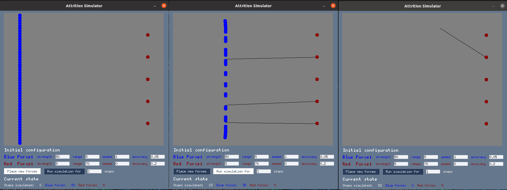

# Attrition Simulator

- **Version:** 0.3
- **Date:** 2022-06-05
- **Contributors:** Steffen Pielström

*Attrition Simulator* is a programme for agent-based simulations of attrition warfare. It is inspired by the classical Lanchester Laws of attrition, but follows an alternative, individual-based, stochastic modeling approach based on modeling individual units and their probability to eliminate an enemy unit.


## Technical overview

The Attrition Simulator is based on a **Python module** (`AttritionSim.py`) that can be used directly to script experiments. The module provides a basic 'unit' class to model units with particular attributes and a 'force' class to model a fighting force of multiple unit class objects. Furthermore, there are functions that create two opposing forces, have them fight each other and print the results. **Simulation parameters** can be set either as arguments to the functions and methods, or by manipulating the configuration file `config.py`.

The file `AttritionSimCLI.py` provides a **command line interface** that can pass simulation parameters as arguments.

For playing and exploration, there is a **graphical user interface** based on the [*PySimpleGui*](https://pysimplegui.readthedocs.io/) package. We provide a version packaged with *pyinstaller* for *Linux* and *Windows* in a *zip* file for download.

## How to use it: the easy way

(Currently only for *Linux*, a *Windows* version is in the making) **Download** the latest release of the standalone GUI version from [release section](https://github.com/cosimg/attritionsim/releases/tag/v0.3) and execute the file ***AttritionSimGui***. Depending on your operating system, it might be necessary to mark the file as executable first.




## How to use it: the nerd way

### as a python module in a script or on the interactive console

Download the module [https://github.com/cosimg/attritionsim](https://github.com/cosimg/attritionsim). Import it with
```
import AttritionSim as sim
```
Create a blue force with 10 units and 5% chance to hit the enemy, and initialize its units.
```
>>> blue_force = sim.force(0, 'blue', strength=10, accuracy=0.05)
>>> blue_force.initialize_units()
>>> blue_force
<AttritionSim.force object at 0x7f4913fbbee0>
```
Create a red force with less men that shoot better.
```
>>> red_force = sim.force(1, 'red', strength=5, accuracy=0.1)
>>> red_force.initialize_units()
```
**Or** rely on the `initialize()` function to do all that at once.
```
>>> sim.initialize(Strength=[10, 5], Accuracy=[0.05, 0.1])
```
Now, you can use the function `update_forces()` to run single iterations.
```
>>> sim.update_forces(blue_force, red_force)
```
Alternatively, you can run an **entire simulation** with initialization and multiple steps with the function `run_simulation()` and return the results. (Please note this is a stochastic simulation, actual output values will not equal the ones shown here and vary with each run.)
```
>>> sim.run_simulation(Strength=[10, 5], Accuracy=[0.05, 0.1])
steps: 28
result: Blue victory
Blue force strength: 7
Red force strength: 0
```

### with the Command Line Interface

The file `AttritionSimCLI.py` can be called from the command line. It will directly execute `run_simulation()` with arguments passed *via* *argparse* or the defaults defined in the configuration file (`config.py`), and return the result.
```
$ python AttritionSimCLI.py --strength_blue 10 --strength_red 5 --accuracy_blue 0.05 --accuracy_red 0.1
steps: 29
result: Blue victory
Blue force strength: 8
Red force strength: 0
```

If you want to get the full data, i.e. the strengths of both forces in each step of the simulation, you can specify that with the `--output` argument, and write it into a file:
```
python AttritionSimCLI.py --output full > simulation001.csv
```

### with the Graphical User Interface started from the Python console

If you have *Python* installed on your computer, you can easily run the GUI version with your *Python* installation. Dependencies are mostly part of the standard library, the only exception being `PySimpleGUI`. To install that you run
```
$ pip install PySimpleGUI
```
Then, you download the module from [https://github.com/cosimg/attritionsim](https://github.com/cosimg/attritionsim), go into the folder and run
```
$ python AttritionSimGUI.py
```

### How to deploy a new version

I am more than happy to accept pull requests with bug fixed, typo corrections, code (and aesthetic) improvements and added features. I only kindly request you to adehere at least to the bare minimum of good conduct regarding modularity, comments, documentation, doctests, cetera that I have been able to instill so far. The standalone GUI version is made with *pyinstaller*:
```
$ pip install pyinstaller
$ pyinstaller -F AttritionSimGUI.py
```
Note that *pyinstaller* can create a standalone program only for the operating system it is running on.

## TODOs and known issues

- GUI Timing: show each simulation step live in the GUI application and synchronize with system time, so that a step in the simulation lasts the nth fraction of a second.
- Battle field size: add the possibility to alter the size of the battle field as a simulation paramter. Currently, the simulation is always running on a 100 x 100 length units grid. 
- Formations: implement more formations than 'one line'
- Hinderance: add an option that units can not shoot 'through each other'
- Range and speed bar: add bars to the GUI that indicate the current range and speed per simulation step for both forces
- GUI Strength curve: add a graph to GUI that shows the strength curves for both forces
- Data output: add an export function to the GUI
- Unit density: find a way to return unit density (number of units per space, maybe in relation to range) to allow for better comparition of results with other Lanchester-type models.
- Implement static typing in AttritionSimGUI.py


## Literature

Lanchester, Frederick W. (1916). *Aircraft in Warfare*. Constable and Company Limited, London.

